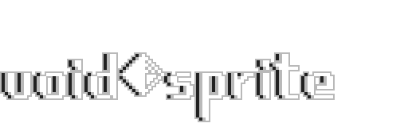
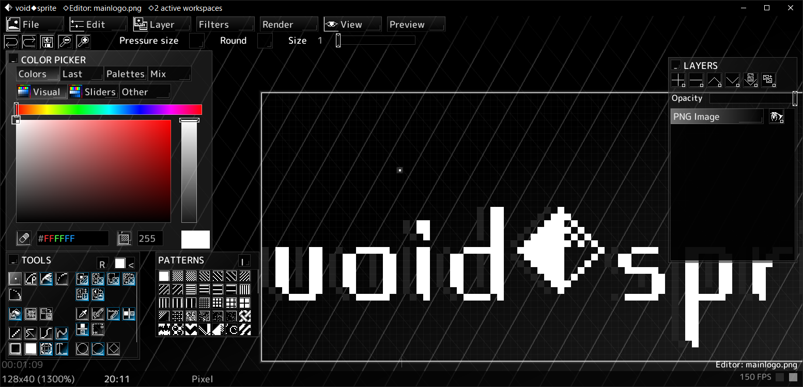

Free C++ pixel art editor

## Supported file formats

✔ - implemented  
〰 - partially implemented  
❔ - implementation non-functional/not finished  
✖ - not implemented  
\* - see notes

### Import / Export

| Name | Extension | Import | Export |
|---|---|:-:|:-:|
| voidsprite session | .voidsn | ✔ | ✔ |
| PNG | .png | ✔ | ✔ |
| JPEG | .jpeg | ✔ | ✔ |
| AVIF | .avif | ✔ | ✔ |
| BMP | .bmp | ✔ | 〰(24-bit only) |
| TGA | .tga | ✔ | 〰(uncomp. 24-bit only) |
| JPEG XL | .jxl | ✔ | ✔ |
| Portable Bitmap, Graymap, Pixmap | .pbm .pgm .pbm | ✔ | 〰(text mode only) |
| X Bitmap | .xbm | ✔ | ✔ |
| Windows cursor | .cur | ✔ | ✔ |
| OpenRaster | .ora | ✔* | ✔* |
| Pixel Studio session | .psp | 〰* | ✔ |
| Pixel Studio (compressed) session | .psx | 〰* | ✔ |
| XYZ (RPG Maker 2000/2003) | .xyz | ✔ | ✔ |
| DIBv5 Clipboard dump | .dibv5 | 〰* | ✔ |
| PBM (Cave Story engine) | .pbm | ✔ | ✔ |
| Valve Texture Format | .vtf | 〰* | ✔(v7.1, BGRA8888) |
| Aseprite Sprite | .aseprite .ase | 〰*(Frame 1 only) | ✔ |
| Piskel | .piskel | 〰 | ✔ |

\* **OpenRaster**: advanced features from painting programs like layer blend modes, etc. are not available here. Exporting the thumbnail will not work until color quantization is implemented.  
\* **Pixel Studio sessions**: a 1:1 read of this format requires accurately implementing every tool from that program. For the best experience, wipe the undo history before attempting an import (`Functions` -> `Resize canvas` -> `Resize` -> `Yes`). Animation is not supported.  
\* **VTF** - no mipmaps are imported or exported. Formats: I8, IA88, A8, RGB565,BGR888,RGB888, BGRA8888, RGBA8888, ARGB8888, ABGR8888, DXT1, DXT3, DXT5  
\* **DIBv5**: JPEG, RLE4 and RLE8 subformats currently not supported.  
\* **Aseprite** - experimental. Only frame 1 is loaded. Layer blend modes and tilemaps are not available here.

### Import only

| Name | Extension | Import | Export |
|---|---|:-:|:-:|
| Nintendo DS banner | .nds | ✔ | ✖ |
| NES (dump CHR-ROM) | .nes | ✔ | ✖ |
| Mario Paint save file | .srm | ✔(only main canvas) | ✖ |
| X-Com SPK, BDY, SCR | .spk .bdy .scr | ✔ | ✖ |
| Windows Shell Scrap | .shs | ✔(uses Win32 API) | ✖ |
| Atrophy Engine texture | .aetex | 〰* | ✖ |
| PS2 Icon | .icn .ico | 〰 | ✖ |
| DirectDraw Surface | .dds | 〰* | ✖ |
| Wii/GameCube TPL | .tpl | 〰* | ✖ |
| Windows 1.0/2.0/3.11 Paint | .msp | ❔ | ✖ |
| PS Vita GXT | .gxt | ❔ | ✖ |
| PSP/PS3 GIM | .gim | ❔ | ✖ |
| Nintendo 3DS app icon | .cxi | ❔ | ✖ |
| Every other SDL_Image format | * | ✔ | ✖ |

\* **Wii TPL** - only I4, RGB5A3, RGBA32  
\* **AETEX** - GXT and Switch ASTC subformats not implemented  
\* **DDS** - only BC1, BC2, BC3 and BGRA8888

### Export only

| Name | Extension | Import | Export |
|---|---|:-:|:-:|
| C header (as uint32_t array) | .h | ✖ | ✔ |
| Python NumPy array | .py | ✖ | ✔ |
| HTML Base64 image | .html | ✖ | ✔ |
| Java BufferedImage | .java | ✖ | 〰* |

\* **Java BufferedImage** - only works for small images. Larger images go beyond the function size limit.  

## Installing

You can grab a pre-built binary from the latest CI artifacts: https://nightly.link/counter185/voidsprite/workflows/msbuild/main

For Windows, get the `voidsprite-build-win64.zip` file.

For Linux, get the `voidsprite-build-linux-flatpak-x86_64.zip` file; this requires [Flatpak](https://flatpak.org) to be installed. You can also try the portable binary from `voidsprite-build-linux.zip`, but this might not work on all systems.

## Building

### Windows

1. Go to `freesprite/devlibs` and extract `devlibs.7z` to the current directory (right click `devlibs.7z` > `Extract here`).
2. Go back to the repository root and run the `copy_devlibs.bat` script
3. Open `freesprite.sln` with Visual Studio and build/run like any other C++ program

### Linux

1. Install the dependencies and their respective development packages: sdl3, sdl3_ttf, sdl3_image, libpng, pugixml, zlib, liblcf, libjxl, libhwy
   * Some dependencies (libpng, pugixml, zlib, liblcf) will be automatically downloaded and built during the build step if not installed - don't worry if your distro does not package them.
   * GCC/G++ 13 or later is required
2. Install meson (note that version 0.62.2 or higher is required; Ubuntu 22.04 users will want to install a newer version directly from pip with `pip3 install --user meson`)
3. Run `./linux_build.sh`
   * You can also pass the `--run` flag to automatically run the built binary, the `--global` flag to install to `/usr/local`, and `--portable` to generate a portable build (assets stored in the same directory as the executable).
   * If you installed a separate version of GCC to use alongside your system install, you can specify a different compiler by setting the `CC` and `CXX` variables while calling `linux_build.sh`, e.g. `CC=gcc-13 CXX=g++-13 ./linux_build.sh`

By default, the generated output files will be placed in `/tmp/voidsprite`. When `--global` is passed, they will be installed to `/usr/local` instead.

#### Flatpak

You can also build the program as a Flatpak, see [Flatpak README](https://github.com/counter185/voidsprite/blob/main/freesprite/linux/flatpak/README.md).

## Community

You may find the [Official Discord server](https://discord.gg/c5SndMJKj2) here.

[Itch.io page](https://cntrpl.itch.io/voidsprite)

[BlueSky page](https://voidsprite.bsky.social/)

## Donate

You can support the project by donating on [itch.io](https://cntrpl.itch.io/voidsprite/purchase)

## Licenses

voidsprite is licensed under GPLv2.

Licenses for other libraries and fonts used in voidsprite can be found in the `OPEN_SOURCE_LICENSES` directory
