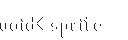
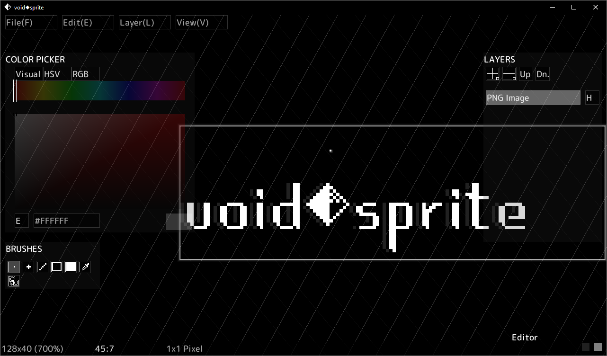

# voidsprite

Free C++ sprite editor

## Supported file formats
### Import:
- PNG
- BMP
- OpenRaster ORA
- RPGMaker 2000/2003 XYZ
- Atrophy Engine AETEX (tga/dds)
- Wii TPL*
- DDS* (DXT1, DXT2/3, DXT4/5)
- Cave Story engine PBM
- VTF* (BGRA, BGR, DXT1, DXT2/3, DXT4/5)
- NES (dumps CHR-ROM)
- Mario Paint save file (SRM)
- all other formats supported by SDL2_Image

\* - not all subformats are currently implemented   

### Export:
- PNG
- OpenRaster ORA
- RPGMaker 2000/2003 XYZ
- BMP
- Cave Story engine PBM
- C header (as `uint8_t` array)
- Python file (as [R,G,B,A] `np.array`)
- HTML document (inline Base64 image)

## Building

### Windows

1. Go to `freesprite/devlibs` and extract `devlibs.7z` to the current directory (right click `devlibs.7z` and `Extract here`).
2. Go back to the repository root and run the `copy_devlibs.bat` script
3. Open `freesprite.sln` with Visual Studio and build/run like any other C++ program

### Linux

1. Install the development dependencies and their base packages: sdl2, sdl2_ttf, sdl2_image, libpng, pugixml, zlib, liblcf
   * Some dependencies (libpng, pugixml, zlib, liblcf) will be automatically downloaded and built during the build step if not installed
2. Install meson (note that version 0.62.2 or higher is required; Ubuntu 22.04 users will want to install a newer version directly from pip with `pip3 install --user meson`)
3. Run `./linux_build.sh`
   * You can also pass the `--run` flag to automatically run the built binary, the `--global` flag to install to `/usr/local`, and `--portable` to generate a portable build (assets stored in the same directory as the executable).

By default, the generated output files will be placed in `/tmp/voidsprite`. When `--global` is passed, they will be installed to `/usr/local` instead.

## Licenses

voidsprite is licensed under GPLv2.

Licenses for other libraries and fonts used in voidsprite can be found in the `OPEN_SOURCE_LICENSES` directory
